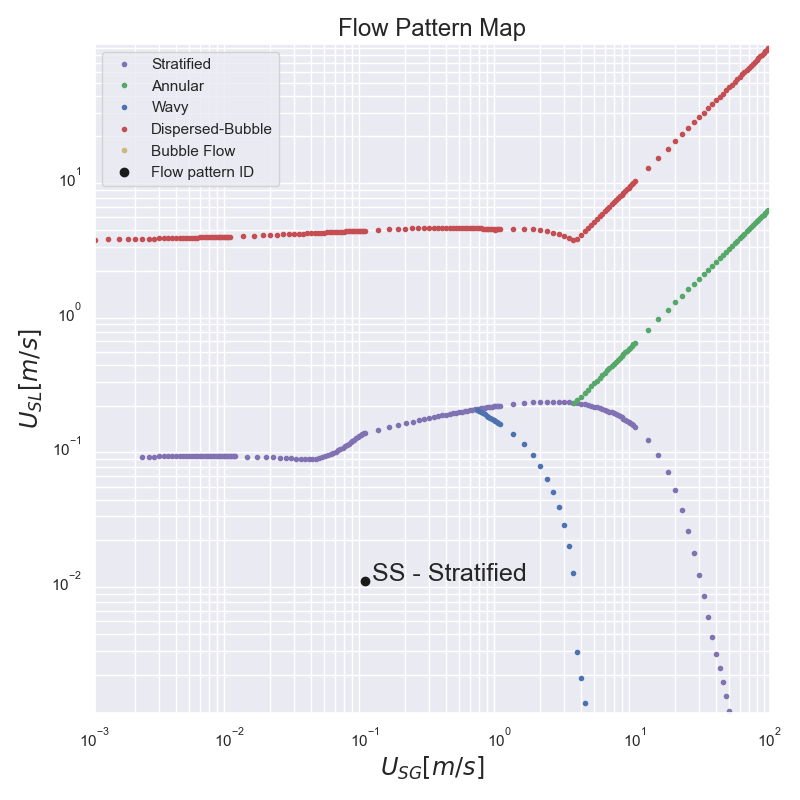

# flow-pattern-map
This repo contains a jupyter notebook with two-phase flow pattern map calculation based on the **FLOPATN - Flow Pattern Prediction and Plotting Computer Code**.

Please Contact to [Dr. Eduardo Pereyra](https://www.researchgate.net/profile/Eduardo_Pereyra2) for more info about `FlowPat.exe`.

# Installation

* Download [miniconda](https://conda.io/miniconda.html).
* Call `conda env create`
* Activate the environment with `conda activate flow-pattern-map`
